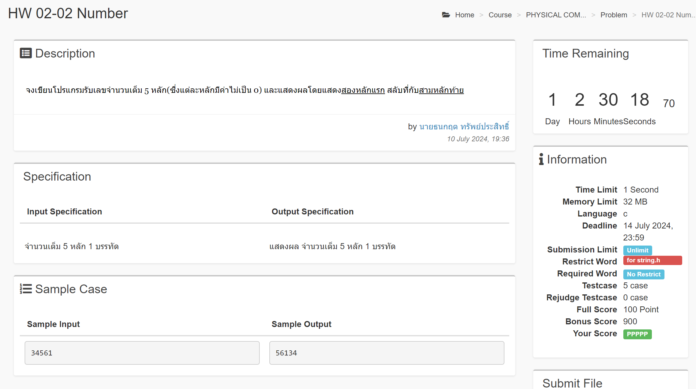

# Homework 02

## HW 02-01 ASCII


<!-- ### how i solved it -->

```c
#include <stdio.h>

int main() {
    int ascii_a = 'a';
    int ascii_Z = 'Z';

    printf("Ascii a: %d\n", ascii_a);
    printf("Ascii Z: %d\n", ascii_Z);

    return 0;
}
```

<br>

## HW 02-02 Number



```c
#include <stdio.h>

int main() {
    char number[5];
    int i;

    scanf("%s", &number);

    printf("%c", number[2]);
    printf("%c", number[3]);
    printf("%c", number[4]);
    printf("%.2s", number);

    return 0;
}
```

<br>

## HW HW 02-03 Number II


```c
#include <stdio.h>

int main() {
    char number[5];

    scanf("%s", &number);
    printf("%.1s", number);
    printf("%82.2s", number);
    printf("%82.3s", number);
    printf("%82.4s", number);
    printf("%82.5s", number);

    return 0;
}
```


