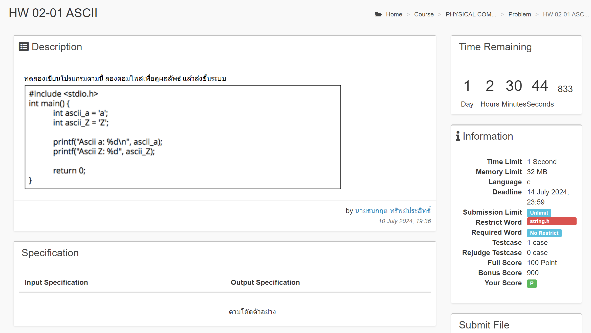

# HW 02-01 ASCII



<!-- **My Solution** -->

## My Solution

```c
#include <stdio.h>

int main() {
    int ascii_a = 'a';
    int ascii_Z = 'Z';

    printf("Ascii a: %d\n", ascii_a);
    printf("Ascii Z: %d\n", ascii_Z);

    return 0;
}
```
