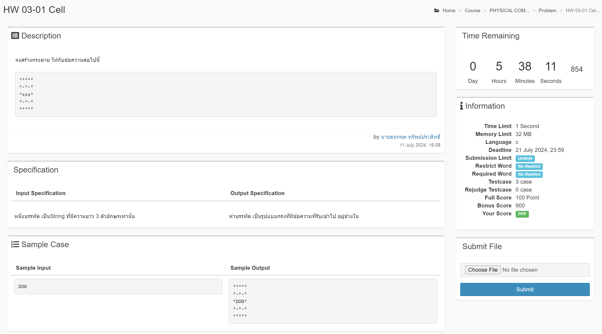
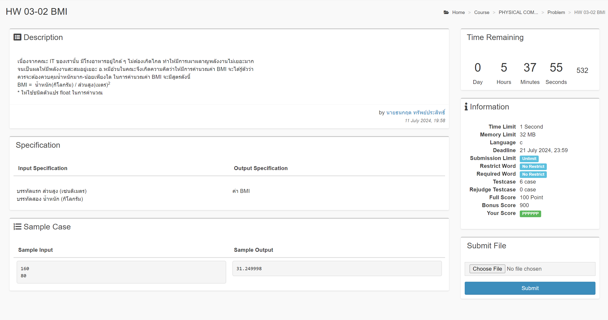

# Homework 03

## HW 03-01 Cell



```c
#include <stdio.h>

int main() {
    char word[3];

    scanf("%s", &word);

    printf("*****");
    printf("\n*-*-*");
    printf("\n*%s*", word);
    printf("\n*-*-*");
    printf("\n*****");

    return 0;
}
```

<br>

## HW 03-02 BMI




```c
#include <stdio.h>
#include <math.h>

int main() {
    float cm, kg;

    scanf("%f", &cm);
    scanf("%f", &kg);

    float m = cm / 100;
    printf("%f", kg / (m * m));

    return 0;
}
```
