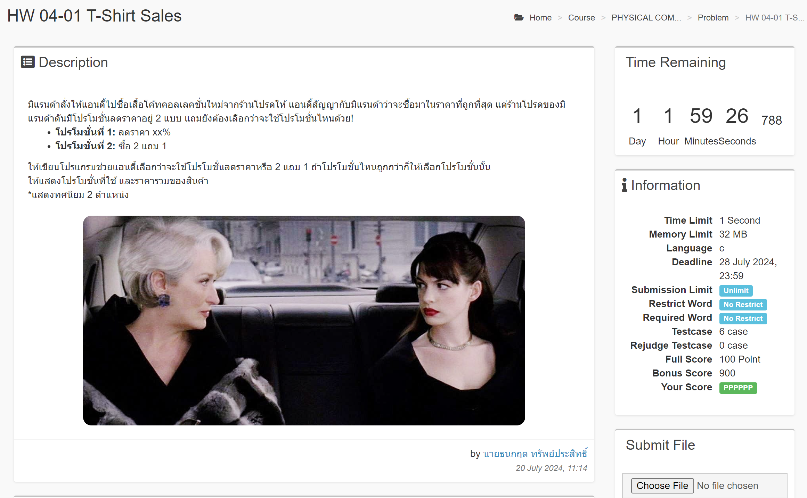
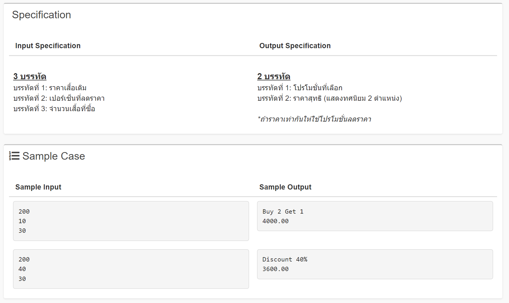
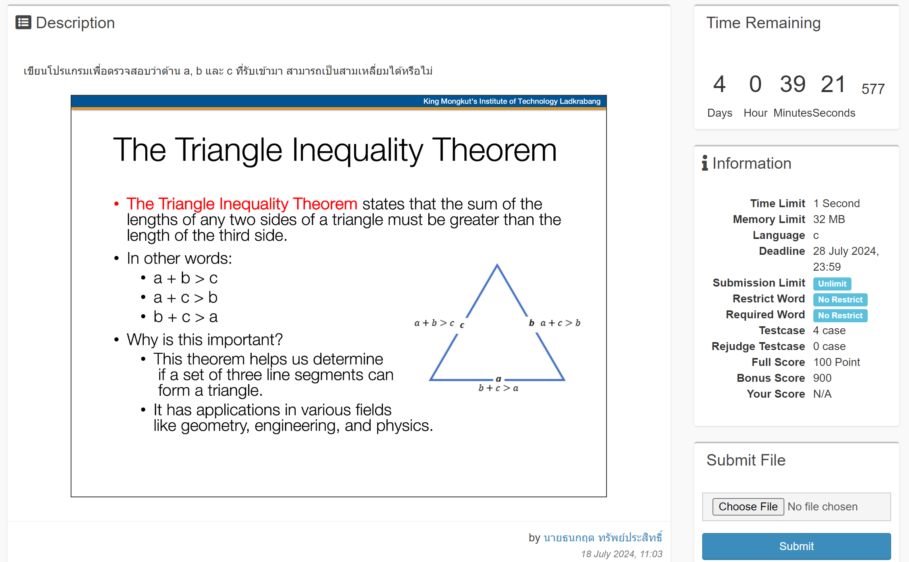
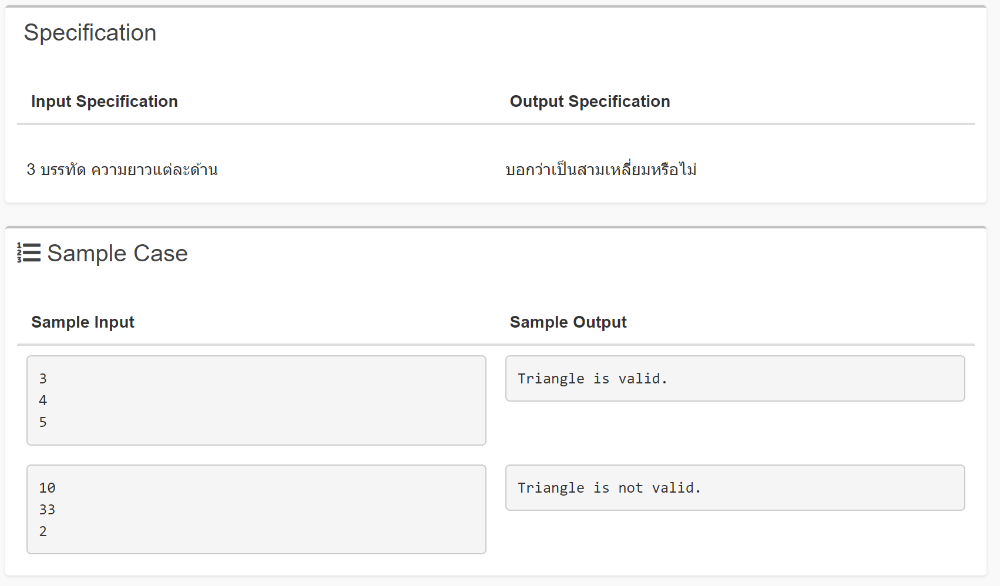

# Homework 04
## HW 04-01 T-Shirt Sales

### question 1



### code 1
```c
#include <stdio.h>
#include <math.h>
 
int main() {
    double price, discount_p, buy2get1_p;
    int amount, percent; 
    double a_2get1, a_2get1_more;

    scanf("%lf %d %d", &price, &percent, &amount);
 
    discount_p = price * ((100.0 - percent) / 100) * amount;

    if (amount < 3) {
        buy2get1_p = price * amount;
    } else {
        a_2get1_more = amount % 3;
        a_2get1 = floor(amount / 3);

        buy2get1_p = ((price * 2) * a_2get1) + (price * a_2get1_more);
    }

    if (discount_p <= buy2get1_p) {
        printf("Discount %d%%", percent);
        printf("\n%.2lf", discount_p);
    } else {
        printf("Buy 2 Get 1");
        printf("\n%.2lf", buy2get1_p);
    }

    return 0;
}
```

<br>
<br>

## HW 04-02 Valid Triangle

### question 2



### code 2
```c
#include <stdio.h>

int main() {
    int side1, side2, side3;

    scanf("%d %d %d", &side1,&side2 ,&side3);

    if ((side1 + side2 > side3) && (side1 + side3 > side2) && (side2 + side3 > side1)) {
        printf("Triangle is valid.");
    } else {
        printf("Triangle is not valid.");
    }

    return 0;
}

```