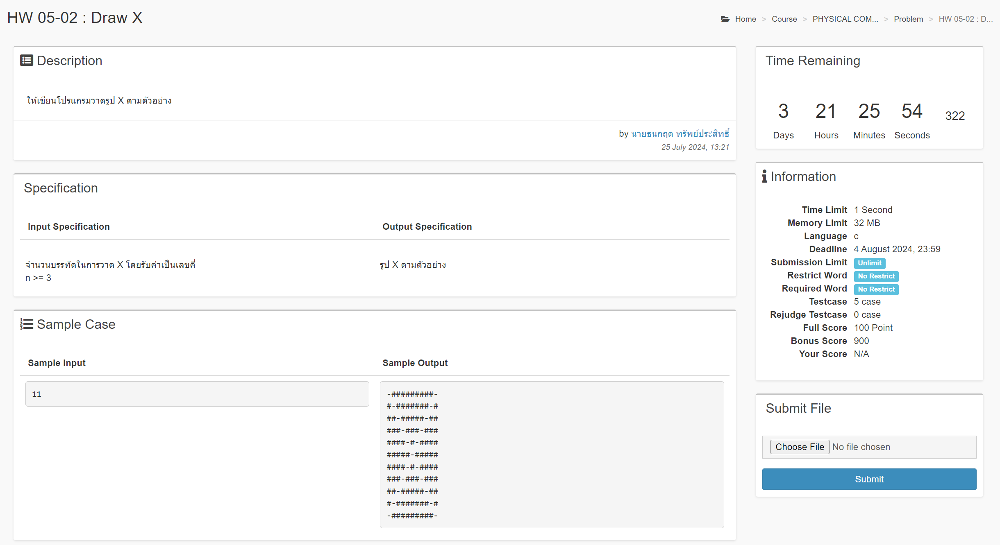

# Homework 05
## HW 05-01 Sum 9
### question


### code
```c
#include <stdio.h>

int main() {
    int i;
    int n = 0;

    do {
        scanf("%d", &i);
        if (i != -9) {
            n = n + i;
        }

    } while (i != -9);

    printf("%d", n);

    return 0;
}
```
<br>


## HW 05-02 Draw X
### question


### code
```c
#include <stdio.h>

int main() {
    int minus, square;
    int n;

    scanf("%d", &n);

    for (int i = 0; i < n; i++) {
        for (int j = 0; j < n; j++) {
            if (i == j || i + j == n - 1){
                printf("-");
            } else {
                printf("#");
            }
        }
        printf("\n");
    }

    return 0;
}
```

### Sample Output
input : 11
```
-#########-
#-#######-#
##-#####-##
###-###-###
####-#-####
#####-#####
####-#-####
###-###-###
##-#####-##
#-#######-#
-#########-
```

<br>


## HW 05-03 Reg System
### question


### code
```c
#include <stdio.h>
#include <math.h>

int main() {
    int age, height, weight;

    int count_1 = 0, count_2 = 0, count_3 = 0, count_4 = 0;

    int sum_age;
    float sum_height, sum_weight;

    for (int i = 0; i < 50; i++) {
        scanf("%d %d %d", &age, &height, &weight);

        if (age >= 20 && height >= 160) {
            count_1 = count_1 + 1;
        }
        
        if (age < 20 && (height <= 180 || weight >= 60)) {
            count_2 = count_2 + 1;
        }
        
        if (age >= 30 && weight >= 40 && weight <= 80) {
            count_3 = count_3 + 1;
        }
        
        if (age < 40 && (weight < 85 || height <= 200)) {
            count_4 = count_4 + 1;
        }

        sum_age = sum_age + age;
        sum_height = sum_height + height;
        sum_weight = sum_weight + weight;
    }

    printf("Age >= 20 and Height >= 160: %d", count_1);
    printf("\n");
    printf("Age < 20 and Height <= 180 or Weight >= 60: %d", count_2);
    printf("\n");
    printf("Age >= 30 and Weight >= 40 and Weight <= 80: %d", count_3);
    printf("\n");
    printf("Age < 40 and Weight < 85 or Height <= 200: %d", count_4);
    
    printf("\n");
    printf("Average Age: %d", (int)round(sum_age / 50));
    printf("\n");
    printf("Average Height: %.2f", sum_height / 50.0);
    printf("\n");
    printf("Average Weight: %.2f", sum_weight / 50.0);

    return 0;

}
```

### Sample Input
```
57 160 132
32 191 92
99 195 83
98 212 104
50 158 131
16 176 117
67 158 95
74 205 55
29 242 132
41 102 62
66 201 124
12 214 109
86 239 32
50 108 58
86 244 119
32 216 87
96 215 71
98 145 93
46 221 70
52 139 128
34 154 128
66 134 88
13 129 99
76 179 77
89 218 75
76 204 128
17 240 64
65 243 65
29 175 133
21 174 108
51 194 69
52 162 38
10 109 99
78 197 124
48 173 41
29 175 91
96 235 63
95 166 83
27 220 131
31 171 125
81 184 44
81 243 119
16 111 59
95 247 33
96 229 115
90 233 72
80 205 66
38 234 43
67 202 58
25 247 62
```

### Sample Output
```
Age >= 20 and Height >= 160: 36
Age < 20 and Height <= 180 or Weight >= 60: 6
Age >= 30 and Weight >= 40 and Weight <= 80: 16
Age < 40 and Weight < 85 or Height <= 200: 13
Average Age: 57
Average Height: 190.56
Average Weight: 87.88
```
<br>


<!-- |**Information A**|**Information B**|
|:---:|:---:|
| Text1 <br/> Text2 |``` kfekfe``` |
| Text3 <br/> Text4 | |
 -->
