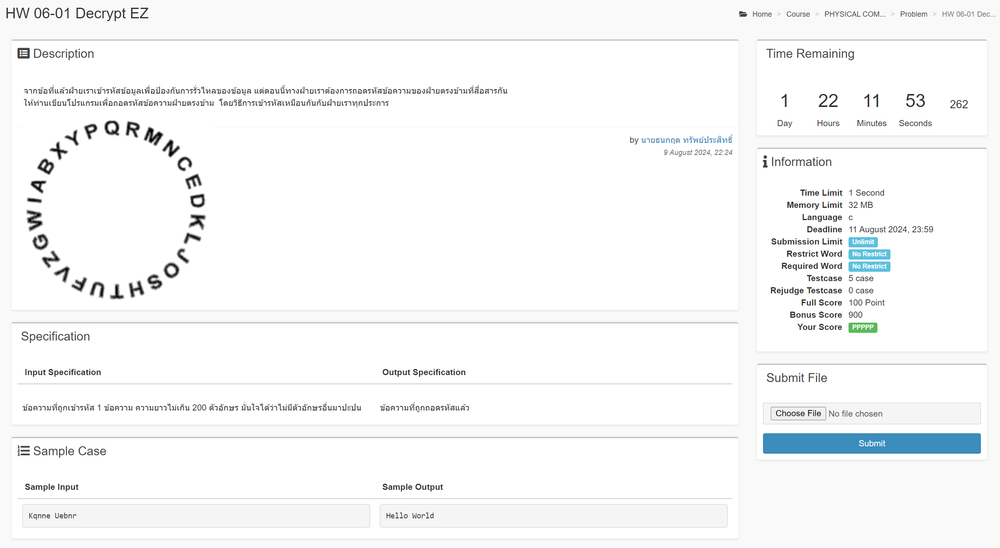
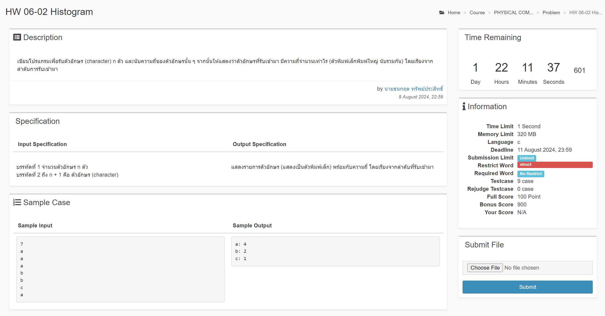
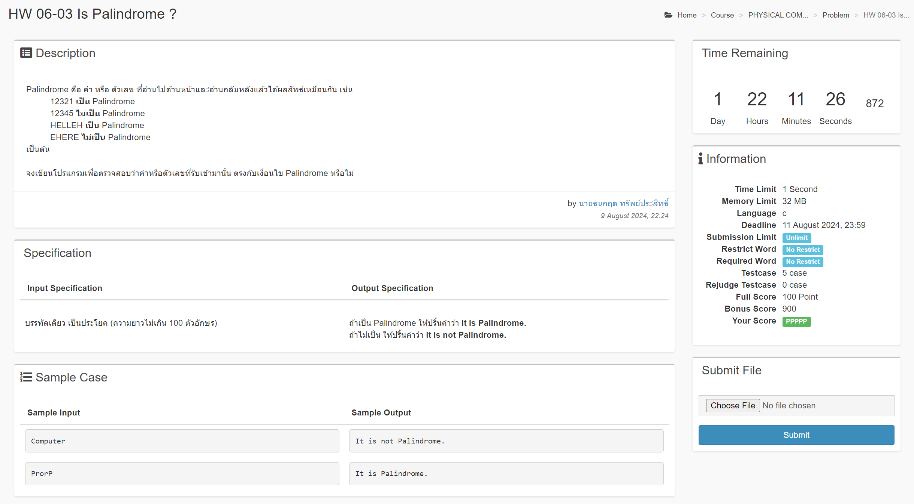

# Homework 06
## HW 06-01 Decrypt EZ

### question


### code
```c
#include <stdio.h>
#include <ctype.h>

int main() {
    char encrypt[] = {'i', 'w', 'g', 'z', 'v', 'f', 'u', 't', 'h', 's', 'o', 
     'j', 'l', 'k', 'd', 'e', 'c', 'n', 'm', 'r', 'q', 'p', 'y', 
     'x', 'b', 'a'};

    char noencrypt[201];

    scanf("%[^\n]", &noencrypt);

    for (int i = 0; i < 201; i++) {
        if (noencrypt[i] == '\0') {
            break;
        } else {
            int upper = 0;

            for (int j = 0; j < sizeof(encrypt); j++) {
                if (isupper(noencrypt[i])) {
                    upper += 1;
                    noencrypt[i] = tolower(noencrypt[i]);
                }

                if (noencrypt[i] == encrypt[j]) {
                    if (j - 5 < 0) {
                        j = 26 + j;
                    } 
                    if (upper == 1) {
                        printf("%c", toupper(encrypt[j-5]));
                    } else {
                        printf("%c", encrypt[j-5]);
                    }
                } else if ((int)noencrypt[i] == 32) {
                    printf(" ");
                    break;
                }
            }
        }
    }
    
    return 0;
}

```

## HW 06-02 Histogram

### question


### code
```c
#include <stdio.h>
#include <ctype.h>

int main() {
    char alpha[27] = {0};
    int count[27] = {0};
    int round = 0, countC = 0;
    char a_input;

    scanf("%d", &round);

    for (int i = 0; i < round; i++) {
        scanf(" %c", &a_input);
        a_input = tolower(a_input);
        
        for (int j = 0; j < 27; j++) {
            if (a_input == alpha[j]) {
                count[j] += 1;
                break;
            } else {
                //^ มีเลขอยู่ข้างใน
                if (isalpha(alpha[j])) {
                    continue;

                //^ ยังไม่มีเลขอยู่ข้างใน
                } else {
                    alpha[j] = a_input;
                    count[j] += 1;
                    countC += 1;
                    break;
                }
            }
        }
    }

    for (int i = 0; i < countC; i++) {
        printf("%c: %d\n", alpha[i], count[i]);
    }

    return 0;
}
```

## HW 06-03 Is Palindrome?

### question


### code
```c
#include <stdio.h>

int main() {
    char word[101];
    char word2[101];
    int count = 0, count2 = 0, palindrome = 0;

    scanf("%s", word);

    for (int i = 0; i < 100; i++) {
        if (word[i] == '\0') {
            break;
        } else {
            count += 1;
        }
    }

    for (int i = count - 1; i >= 0; i--) { // ลง
        if (word[i] == word[count2]) {
            count2 += 1;
            palindrome += 1;
        }
    }

    if (palindrome == count) {
        printf("It is Palindrome.");
    } else {
        printf("It is not Palindrome.");
    }

    return 0;
}
```