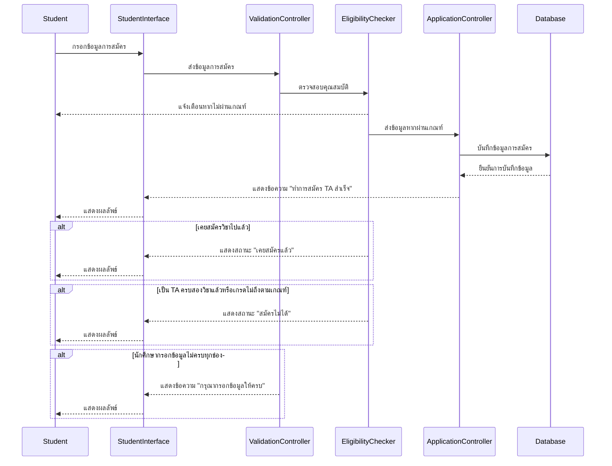

```mermaid
sequenceDiagram
    participant Student
    participant StudentInterface
    participant ValidationController
    participant EligibilityChecker
    participant ApplicationController
    participant Database

    Student ->> StudentInterface: กรอกข้อมูลการสมัคร
    StudentInterface ->> ValidationController: ส่งข้อมูลการสมัคร
    ValidationController ->> EligibilityChecker: ตรวจสอบคุณสมบัติ
    EligibilityChecker -->> Student: แจ้งเตือนหากไม่ผ่านเกณฑ์
    EligibilityChecker ->> ApplicationController: ส่งข้อมูลหากผ่านเกณฑ์
    ApplicationController ->> Database: บันทึกข้อมูลการสมัคร
    Database -->> ApplicationController: ยืนยันการบันทึกข้อมูล
    ApplicationController -->> StudentInterface: แสดงข้อความ "ทำการสมัคร TA สำเร็จ"
    StudentInterface -->> Student: แสดงผลลัพธ์

    alt เคยสมัครวิชาไปแล้ว
        EligibilityChecker -->> StudentInterface: แสดงสถานะ "เคยสมัครแล้ว"
        StudentInterface -->> Student: แสดงผลลัพธ์
    end

    alt เป็น TA ครบสองวิชาแล้วหรือเกรดไม่ถึงตามเกณฑ์
        EligibilityChecker -->> StudentInterface: แสดงสถานะ "สมัครไม่ได้"
        StudentInterface -->> Student: แสดงผลลัพธ์
    end

    alt นักศึกษากรอกข้อมูลไม่ครบทุกช่อง
        ValidationController -->> StudentInterface: แสดงข้อความ "กรุณากรอกข้อมูลให้ครบ"
        StudentInterface -->> Student: แสดงผลลัพธ์
    end
```