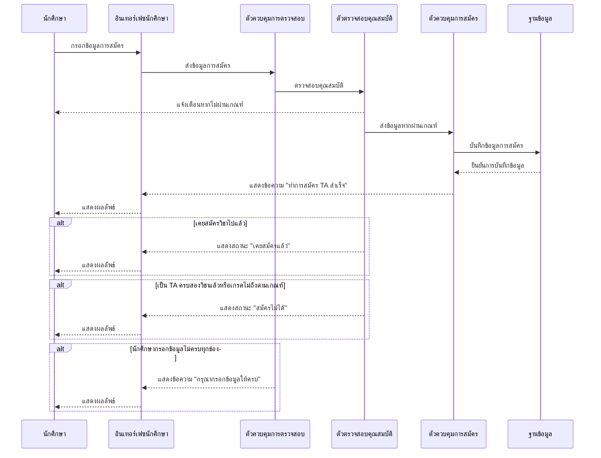

```mermaid
sequenceDiagram
    participant นักศึกษา
    participant อินเทอร์เฟซนักศึกษา
    participant ตัวควบคุมการตรวจสอบ
    participant ตัวตรวจสอบคุณสมบัติ
    participant ตัวควบคุมการสมัคร
    participant ฐานข้อมูล

    นักศึกษา ->> อินเทอร์เฟซนักศึกษา: กรอกข้อมูลการสมัคร
    อินเทอร์เฟซนักศึกษา ->> ตัวควบคุมการตรวจสอบ: ส่งข้อมูลการสมัคร
    ตัวควบคุมการตรวจสอบ ->> ตัวตรวจสอบคุณสมบัติ: ตรวจสอบคุณสมบัติ
    ตัวตรวจสอบคุณสมบัติ -->> นักศึกษา: แจ้งเตือนหากไม่ผ่านเกณฑ์
    ตัวตรวจสอบคุณสมบัติ ->> ตัวควบคุมการสมัคร: ส่งข้อมูลหากผ่านเกณฑ์
    ตัวควบคุมการสมัคร ->> ฐานข้อมูล: บันทึกข้อมูลการสมัคร
    ฐานข้อมูล -->> ตัวควบคุมการสมัคร: ยืนยันการบันทึกข้อมูล
    ตัวควบคุมการสมัคร -->> อินเทอร์เฟซนักศึกษา: แสดงข้อความ "ทำการสมัคร TA สำเร็จ"
    อินเทอร์เฟซนักศึกษา -->> นักศึกษา: แสดงผลลัพธ์

    alt เคยสมัครวิชาไปแล้ว
        ตัวตรวจสอบคุณสมบัติ -->> อินเทอร์เฟซนักศึกษา: แสดงสถานะ "เคยสมัครแล้ว"
        อินเทอร์เฟซนักศึกษา -->> นักศึกษา: แสดงผลลัพธ์
    end

    alt เป็น TA ครบสองวิชาแล้วหรือเกรดไม่ถึงตามเกณฑ์
        ตัวตรวจสอบคุณสมบัติ -->> อินเทอร์เฟซนักศึกษา: แสดงสถานะ "สมัครไม่ได้"
        อินเทอร์เฟซนักศึกษา -->> นักศึกษา: แสดงผลลัพธ์
    end

    alt นักศึกษากรอกข้อมูลไม่ครบทุกช่อง
        ตัวควบคุมการตรวจสอบ -->> อินเทอร์เฟซนักศึกษา: แสดงข้อความ "กรุณากรอกข้อมูลให้ครบ"
        อินเทอร์เฟซนักศึกษา -->> นักศึกษา: แสดงผลลัพธ์
    end
```