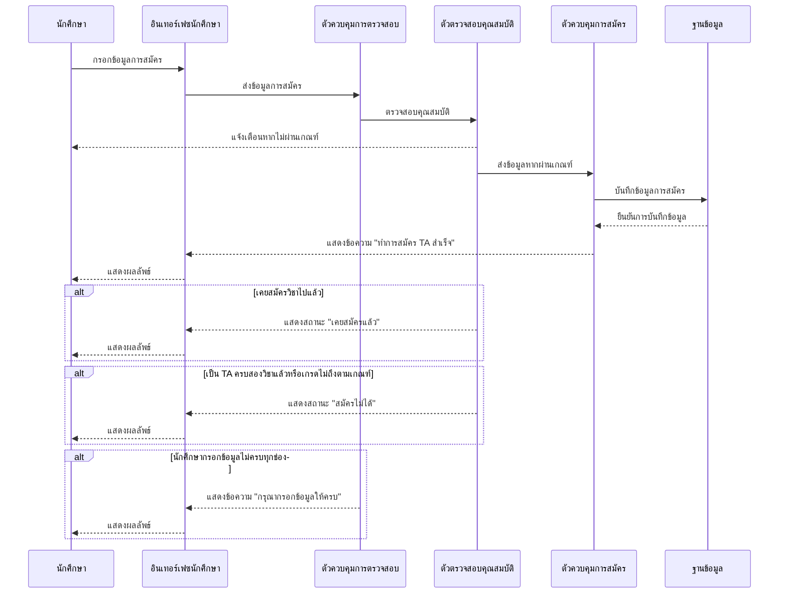

```mermaid
%% sequenceDiagram
%%     participant Student
%%     participant StudentInterface
%%     participant ValidationController
%%     participant EligibilityChecker
%%     participant ApplicationController
%%     participant Database

%%     Student ->> StudentInterface: กรอกข้อมูลการสมัคร
%%     StudentInterface ->> ValidationController: ส่งข้อมูลการสมัคร
%%     ValidationController ->> EligibilityChecker: ตรวจสอบคุณสมบัติ
%%     EligibilityChecker -->> Student: แจ้งเตือนหากไม่ผ่านเกณฑ์
%%     EligibilityChecker ->> ApplicationController: ส่งข้อมูลหากผ่านเกณฑ์
%%     ApplicationController ->> Database: บันทึกข้อมูลการสมัคร
%%     Database -->> ApplicationController: ยืนยันการบันทึกข้อมูล
%%     ApplicationController -->> StudentInterface: แสดงข้อความ "ทำการสมัคร TA สำเร็จ"
%%     StudentInterface -->> Student: แสดงผลลัพธ์

%%     alt เคยสมัครวิชาไปแล้ว
%%         EligibilityChecker -->> StudentInterface: แสดงสถานะ "เคยสมัครแล้ว"
%%         StudentInterface -->> Student: แสดงผลลัพธ์
%%     end

%%     alt เป็น TA ครบสองวิชาแล้วหรือเกรดไม่ถึงตามเกณฑ์
%%         EligibilityChecker -->> StudentInterface: แสดงสถานะ "สมัครไม่ได้"
%%         StudentInterface -->> Student: แสดงผลลัพธ์
%%     end

%%     alt นักศึกษากรอกข้อมูลไม่ครบทุกช่อง
%%         ValidationController -->> StudentInterface: แสดงข้อความ "กรุณากรอกข้อมูลให้ครบ"
%%         StudentInterface -->> Student: แสดงผลลัพธ์
%%     end

sequenceDiagram
    participant นักศึกษา
    participant อินเทอร์เฟซนักศึกษา
    participant ตัวควบคุมการตรวจสอบ
    participant ตัวตรวจสอบคุณสมบัติ
    participant ตัวควบคุมการสมัคร
    participant ฐานข้อมูล

    นักศึกษา ->> อินเทอร์เฟซนักศึกษา: กรอกข้อมูลการสมัคร
    อินเทอร์เฟซนักศึกษา ->> ตัวควบคุมการตรวจสอบ: ส่งข้อมูลการสมัคร
    ตัวควบคุมการตรวจสอบ ->> ตัวตรวจสอบคุณสมบัติ: ตรวจสอบคุณสมบัติ
    ตัวตรวจสอบคุณสมบัติ -->> นักศึกษา: แจ้งเตือนหากไม่ผ่านเกณฑ์
    ตัวตรวจสอบคุณสมบัติ ->> ตัวควบคุมการสมัคร: ส่งข้อมูลหากผ่านเกณฑ์
    ตัวควบคุมการสมัคร ->> ฐานข้อมูล: บันทึกข้อมูลการสมัคร
    ฐานข้อมูล -->> ตัวควบคุมการสมัคร: ยืนยันการบันทึกข้อมูล
    ตัวควบคุมการสมัคร -->> อินเทอร์เฟซนักศึกษา: แสดงข้อความ "ทำการสมัคร TA สำเร็จ"
    อินเทอร์เฟซนักศึกษา -->> นักศึกษา: แสดงผลลัพธ์

    alt เคยสมัครวิชาไปแล้ว
        ตัวตรวจสอบคุณสมบัติ -->> อินเทอร์เฟซนักศึกษา: แสดงสถานะ "เคยสมัครแล้ว"
        อินเทอร์เฟซนักศึกษา -->> นักศึกษา: แสดงผลลัพธ์
    end

    alt เป็น TA ครบสองวิชาแล้วหรือเกรดไม่ถึงตามเกณฑ์
        ตัวตรวจสอบคุณสมบัติ -->> อินเทอร์เฟซนักศึกษา: แสดงสถานะ "สมัครไม่ได้"
        อินเทอร์เฟซนักศึกษา -->> นักศึกษา: แสดงผลลัพธ์
    end

    alt นักศึกษากรอกข้อมูลไม่ครบทุกช่อง
        ตัวควบคุมการตรวจสอบ -->> อินเทอร์เฟซนักศึกษา: แสดงข้อความ "กรุณากรอกข้อมูลให้ครบ"
        อินเทอร์เฟซนักศึกษา -->> นักศึกษา: แสดงผลลัพธ์
    end
```